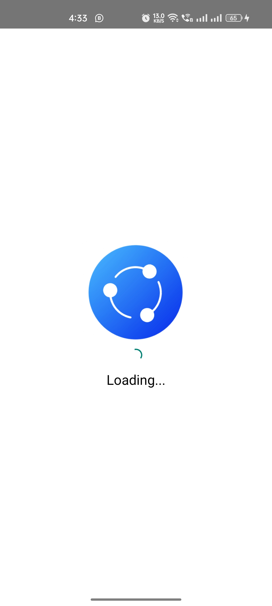
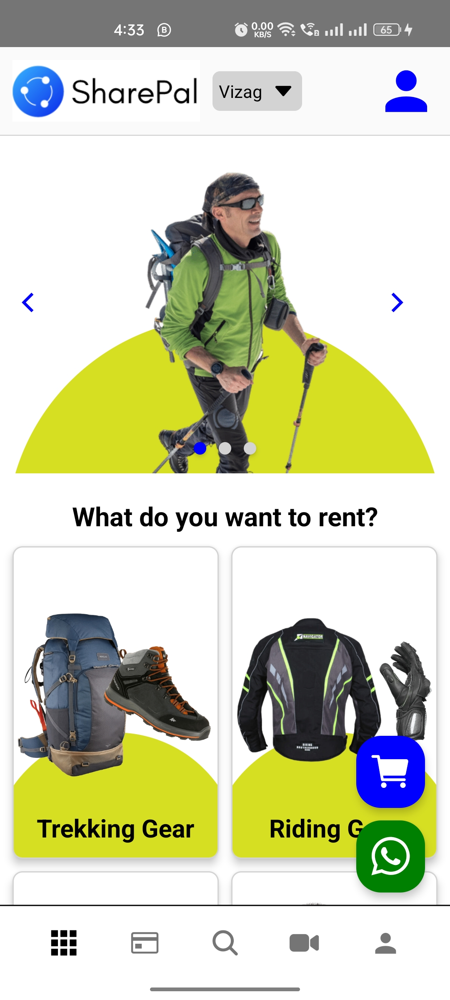
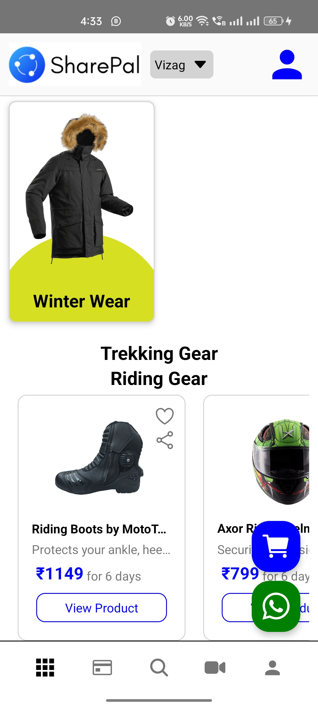

# sharePalCloneUI

<h2>Click on this image to watch video </h2>
<a href='https://youtube.com/shorts/Qg6o3DB7Xhw?feature=share'  >
Youtube Link : https://youtube.com/shorts/Qg6o3DB7Xhw?feature=share

</a>
